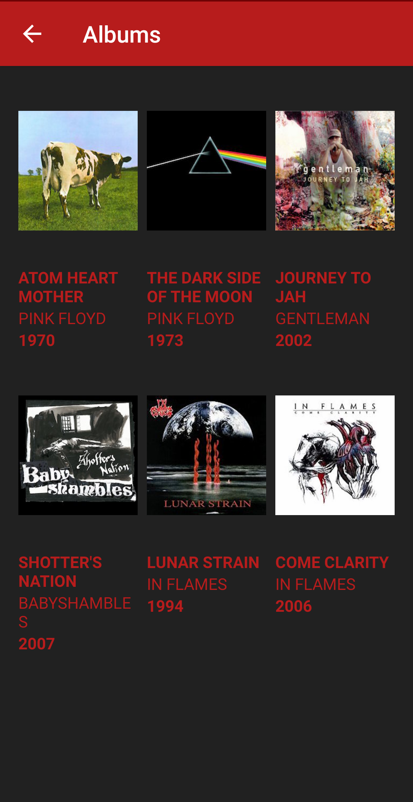
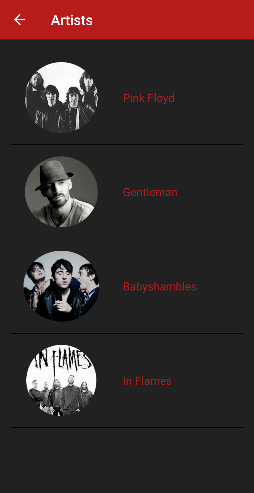

## Musical Structure App
Udacity Android Basics Nanodegree Project No. 4: Musical Structure App

<b>PROJECT SPECIFICATIONS</b>

1. The app’s structure is suitable for a music player app.

2. The app contains 6 activities, each labelled, which together make a cohesive music app.

3. Features in the app are clearly defined either by labelling or images. For example, a button to play music could use a     universally recognized triangular "Play" symbol or could have the text label "Play".

4. Each activity contains button(s) which link it to other activities a user should be able to reach from that activity. A Songs Activity contain a button to move to the songs list activity, from there we can navigate to Now Playing Activity (which is displaying current playing song). Albums Activity contains a button to move to the list of albums, from there we can move to the list of songs that the picked album contains and move to now playing activity. Artists Activity contains list of artists, from there we can move to the albums by the artist. 

5. The code adheres to all of the following best practices:
   - Text sizes are defined in sp
   - Lengths are defined in dp
   - Padding and margin is used appropriately, such that the views are not crammed up against each other.
   
6. App contains both ListView and GridView.

7. App contains MusicLibrary class with the ArrayList holding list of songs.

Optional:

First verion of app met project specifications, but due to the review suggestions and for practice purposes:
- ButterKnife field and method binding for Android views was added 
- ViewHolders added
- Up Navigation added

#### App Screenshots 

    

